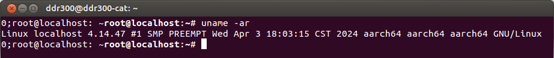
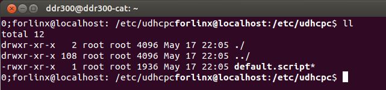
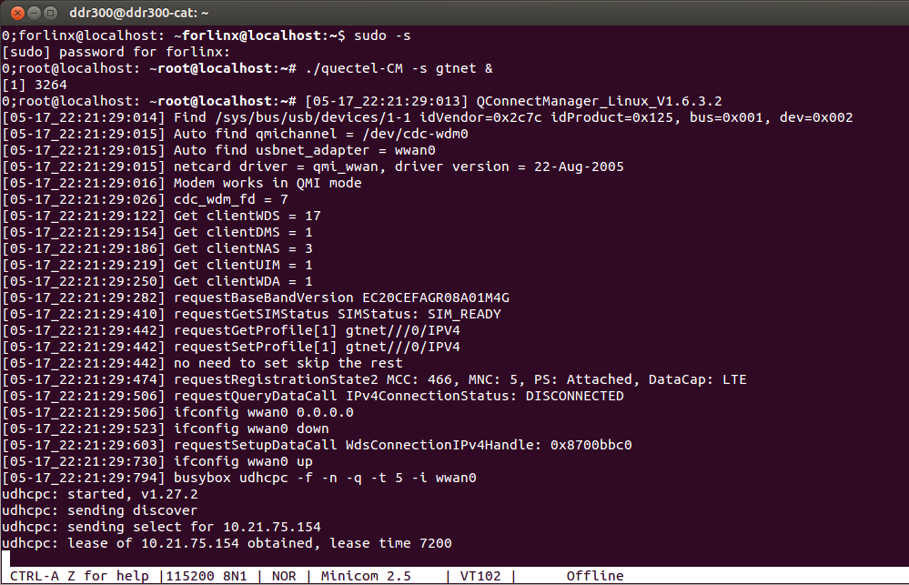

# OK1012A_LS1012A_EC20
LS1012A / OK1012A EC20  GSM modem

Forlinx OK1012A, official image of ubuntu 

18.
# in progress
The offical kernal comes with EC20 driver.
 
 
 

need add a file
/et/udhcpc/default.script
 
 
 

Run quectel-CM
 
 
 

