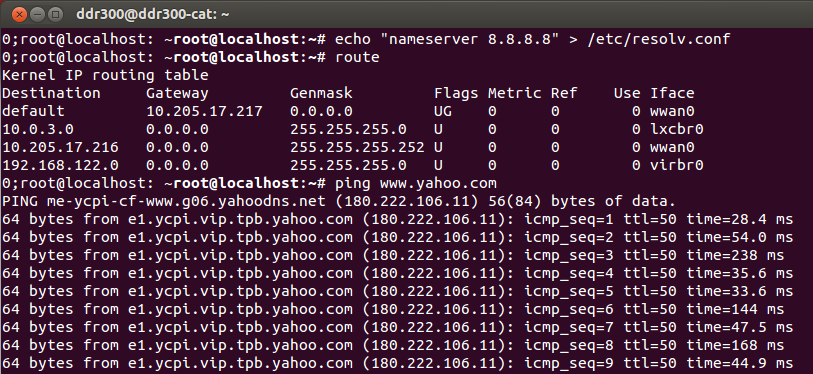

# OK1012A_LS1012A_EC20
LS1012A / OK1012A EC20  GSM modem

Forlinx OK1012A, official image of ubuntu 

18.
# in progress
The offical kernal comes with EC20 driver.
 
 
 

need to add a file
/et/udhcpc/default.script
 
 
 

Run quectel-CM V1.6.3.2
 
 
 
force change DNS for ping 
echo "nameserver 8.8.8.8" > /etc/resolv.conf 
 
 
 
